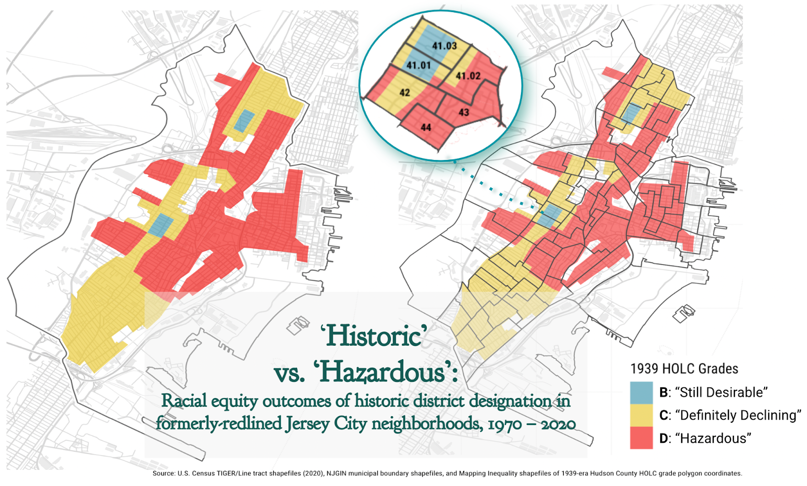

How Has Historic District Designation Impacted Jersey City’s Redlined
Neighborhoods?
================

- <a href="#project-intro" id="toc-project-intro">Project Intro</a>
- <a href="#methods" id="toc-methods">Methods</a>
- <a href="#data-sources" id="toc-data-sources">Data Sources</a>
- <a href="#r-libraries" id="toc-r-libraries">R Libraries</a>
- <a href="#import-spatial-data-layers"
  id="toc-import-spatial-data-layers">Import Spatial Data Layers</a>
- <a
  href="#adjust-all-spatial-layers-coordinate-reference-systems-to-epsg3424-nad83new-jersey"
  id="toc-adjust-all-spatial-layers-coordinate-reference-systems-to-epsg3424-nad83new-jersey">Adjust
  all spatial layers’ coordinate reference systems to EPSG:3424 (NAD83/New
  Jersey)</a>
- <a
  href="#calculate-redlined-and-historic-districted-area-within-each-2020-census-tract"
  id="toc-calculate-redlined-and-historic-districted-area-within-each-2020-census-tract">Calculate
  Redlined and Historic-Districted Area Within Each 2020 Census Tract</a>
- <a href="#create-master-sf-and-df-for-mapping--census-joins"
  id="toc-create-master-sf-and-df-for-mapping--census-joins">Create master
  sf and df for mapping &amp; Census joins</a>
- <a href="#import-census-data-1970---2020"
  id="toc-import-census-data-1970---2020">Import Census Data, 1970 -
  2020</a>
- <a
  href="#create-decennial-timeline-of-selected-housingincomerace-variables"
  id="toc-create-decennial-timeline-of-selected-housingincomerace-variables">Create
  decennial timeline of selected housing/income/race variables</a>
- <a href="#add-2020-acs-5-yr-estimates"
  id="toc-add-2020-acs-5-yr-estimates">Add 2020 ACS 5-yr estimates</a>
- <a href="#tables" id="toc-tables">Tables</a>
- <a href="#summary-stats" id="toc-summary-stats">Summary stats</a>
- <a href="#plots" id="toc-plots">Plots</a>
- <a href="#maps" id="toc-maps">Maps</a>

Sarah Ligon [@ligonish](github.com/ligonish)  
March 2023



## Project Intro

In 1939, the federal Home Owners’ Loan Corporation (HOLC) redlined
virtually every neighborhood in Jersey City as ineligible for home
loans, barring future generations of the city’s predominantly Black,
brown, and immigrant population from access to mortgages and housing
stability.

This project ([full writeup available
here](ligonish.github.io/redlined-jc)) seeks to support local-level,
anti-racist housing policy by tracing aggregate patterns of income,
housing tenure, and race across the modern-day Jersey City census tracts
whose areas were labelled more than 50% “D” (“Hazardous”) or “C”
(“Definitely Declining”) by the HOLC in 1939.

Taken together, formerly-redlined neighborhoods in Jersey City do on
average exhibit lower incomes and rates of homeownership than in the
total area the HOLC marked mortgageable. But today, within those
once-redlined census tracts, large clusters also show massive income,
housing tenure, and racial disparities from the rest of the city.

This analysis points to one local policy that correlates with
significantly worsened racial inequities within already-redlined
neighborhoods: that of locally-zoned historic district designation.

I first began this project during Dr. Vanessa L. Deane’s fantastic
graduate seminar on “Race, Ethnicity, Class, & Gender in American
Cities”, at the New York University Wagner Schools of Urban Planning and
Public Policy. My thanks to her, and to all my classmates, for teaching
me.

## Methods

Today’s census tracts boundaries don’t overlap cleanly with those used
by the HOLC. Nor, for that matter, do they overlap with census tract
boundaries from 1970, or even 2000. To track U.S. Census estimates
across redlined areas of Jersey City, I

1.  Downloaded the [Mapping Inequality]() project’s Hudson County
    redlining polygon layer, along with Jersey City government’s spatial
    layer of locally-zoned historic districts;
2.  Normalized all layers to the NJ State Plane coordinate reference
    system (NAD83), which calculates length in feet and thus area in
    square feet;
3.  Calculated both redlined and historic area overlaps with standard
    2020-era TIGER/Line U.S. census tracts;
4.  Assigned census tracts the indicators “redlined” and/or “historic”
    if \>= 50% of their square footage overlapped with that designation
    in the older maps. (In the case of redlined tracts, I assigned as
    “redlined” all tracts whose square footage contained overlap from
    either C or D.)
5.  Downloaded decennial U.S. Census estimates for redlined Jersey City
    census tracts from 1970 - 2010 using Geolytics’ “Neighborhood Change
    Database”, which normalizes decennial census summary files to modern
    TIGER/Line census-tract boundaries. I also imputed ACS 5-year
    estimates in place of 2020 decennial data, since those decennial
    estimates have not as of March 2023 been released. (Reader! Do not
    do this! Decennial and 5-year estimates are highly noncomparable —
    here, they’re a placeholder to spark curiosity for when the 2020
    decennial comes out later this spring.)

## Data Sources

- NJOIT Office of GIS:
  - [Municipal Boundaries of New
    Jersey](https://njogis-newjersey.opendata.arcgis.com/datasets/newjersey::municipal-boundaries-of-nj/about)
  - [NJ Census Tracts
    2020](https://njogis-newjersey.opendata.arcgis.com/datasets/newjersey::census-tracts-2020-hosted-3424/about)
  - [Historic Districts of
    NJ](https://njogis-newjersey.opendata.arcgis.com/datasets/njdep::historic-districts-of-new-jersey/about)
- U.S. Census Bureau. (2020). [2016-2020 American Community Survey
  5-year Public Use Microdata
  Samples.](https://www.census.gov/data/developers/data-sets/acs-5year.2020.html#list-tab-1036221584)
  R files retrieved via
  [*tidycensus*.](https://walker-data.com/tidycensus/)
- [Geolytics Neighborhood Change Database
  (NCDB)](https://geolytics.com/products/normalized-data/neighborhood-change-database)
  \[online demographic data\]. (n.d.). GeoLytics, Inc. Accessed via [New
  York University library](https://guides.nyu.edu/govdocs/census) system
  (ID required), March 2023.  
- University of Richmond, [“Mapping Inequality,” American Panorama,
  ed. Robert K. Nelson and Edward L.
  Ayers.](https://dsl.richmond.edu/panorama/redlining/#loc=11/40.631/-74.078&city=hudson-co.-nj)
  The “Mapping Inequality” team also maintains a GitHub of sf and
  geojson files pre-crosswalked to 2000, 2010, & 2020 U.S. census tracts
  [here.](https://github.com/americanpanorama/Census_HOLC_Research)

## R Libraries

``` r
library(tidyverse)   # data manipulation
library(janitor)     # data cleaning
library(lubridate)   # pesky date/time fixer
library(sf)          # tidyverse-friendly spatial data manipulation 
library(tidycensus)  # ACS, decennial, NHGIS, & limited IPUMS microdata from U.S. Census Bureau API
library(ggmap)       # Stamen basemaps for in-R mapping
library(knitr)       # pretty tables
library(kableExtra)  # prettier tables
library(gghighlight) # isolates variables in visuals
library(wesanderson) # color palettes
library(hrbrthemes)  # chart themes

options(tigris_use_cache = T)
```

## Import Spatial Data Layers

#### 2020: Jersey City municipal boundaries

``` r
jc_boundaries <- st_read("data/jc_boundaries_njgin/Municipal_Boundaries_of_NJ.shp") %>% 
  select(geometry)
```

    ## Reading layer `Municipal_Boundaries_of_NJ' from data source 
    ##   `/Users/Sarah/Dropbox/Mac/Desktop/redlined_jc_histdists/data/jc_boundaries_njgin/Municipal_Boundaries_of_NJ.shp' 
    ##   using driver `ESRI Shapefile'
    ## Simple feature collection with 1 feature and 26 fields
    ## Geometry type: MULTIPOLYGON
    ## Dimension:     XY
    ## Bounding box:  xmin: 598462.4 ymin: 668193 xmax: 623335.7 ymax: 705352.5
    ## Projected CRS: NAD83 / New Jersey (ftUS)

#### 2020: Jersey City census tract boundaries

``` r
jc_tracts_20 <- st_read("data/ESRI_JC_Tract_Layer/jc_2020_tracts.shp") %>% 
  clean_names() %>% 
  remove_constant() %>% 
  select(geoid, name, namelsad, geometry) %>% 
  mutate(tract_area = st_area(geometry)) # adds 2020 tract areas in sq ft
```

    ## Reading layer `jc_2020_tracts' from data source 
    ##   `/Users/Sarah/Dropbox/Mac/Desktop/redlined_jc_histdists/data/ESRI_JC_Tract_Layer/jc_2020_tracts.shp' 
    ##   using driver `ESRI Shapefile'
    ## Simple feature collection with 77 features and 12 fields
    ## Geometry type: POLYGON
    ## Dimension:     XY
    ## Bounding box:  xmin: -74.11706 ymin: 40.66163 xmax: -74.02064 ymax: 40.76899
    ## Geodetic CRS:  WGS 84

#### 1939: Jersey City HOLC-Graded Areas

``` r
holc <- st_read("data/HudCo_1939_shapefiles/cartodb-query.shp") %>%
  clean_names() %>% 
  subset(name == "Jersey City") %>% 
  remove_constant()  
```

    ## Reading layer `cartodb-query' from data source 
    ##   `/Users/Sarah/Dropbox/Mac/Desktop/redlined_jc_histdists/data/HudCo_1939_shapefiles/cartodb-query.shp' 
    ##   using driver `ESRI Shapefile'
    ## Simple feature collection with 60 features and 3 fields
    ## Geometry type: MULTIPOLYGON
    ## Dimension:     XY
    ## Bounding box:  xmin: -74.16498 ymin: 40.64487 xmax: -73.99199 ymax: 40.81422
    ## Geodetic CRS:  WGS 84

#### 1970 - 2020: Locally Designated Historic Districts

``` r
historic <- st_read("data/Historic_Districts/Districts/Historic_Districts_of_New_Jersey.shp") %>% 
  clean_names() %>% 
  filter(str_detect(name, "Hamilton|Harsimus Cove|Paulus|Vorst|West Bergen")) %>%
  select(name, status, nrdate, srdate, localdate, geometry) 
```

    ## Reading layer `Historic_Districts_of_New_Jersey' from data source 
    ##   `/Users/Sarah/Dropbox/Mac/Desktop/redlined_jc_histdists/data/Historic_Districts/Districts/Historic_Districts_of_New_Jersey.shp' 
    ##   using driver `ESRI Shapefile'
    ## Simple feature collection with 129 features and 51 fields
    ## Geometry type: MULTIPOLYGON
    ## Dimension:     XY
    ## Bounding box:  xmin: 296755.3 ymin: 498274.7 xmax: 632815.7 ymax: 828619.5
    ## Projected CRS: NAD83 / New Jersey (ftUS)

## Adjust all spatial layers’ coordinate reference systems to EPSG:3424 (NAD83/New Jersey)

TIGER/Line census files store projections in units of degrees rather
than feet. We need the latter for accurate area calculations.

``` r
jc_tracts_20 <- jc_tracts_20 %>% st_transform(crs = st_crs(historic)) %>% 
  st_intersection(jc_boundaries) # clips uninhabited edges of tracts that extend far into the Hudson River, for later mapping

holc <- holc %>% st_transform(crs = st_crs(historic))

st_crs(jc_boundaries, jc_tracts_20, holc, historic)  # NAD 83 / EPSG 3424
```

## Calculate Redlined and Historic-Districted Area Within Each 2020 Census Tract

#### Tract overlaps: 1939 HOLC-graded regions

``` r
holc_overlaps <- st_intersection(
  holc, 
  jc_tracts_20) %>% 
  mutate(grade_overlaps = st_area(geometry)) %>% 
  group_by(geoid, holc_grade) %>% 
  mutate(grade_area = sum(st_area(geometry)),
         grade_prop = as.numeric(grade_area / tract_area)
         ) %>% 
  ungroup() %>% 
  mutate(pct_b = round(case_when(holc_grade == "B" ~ 100 * grade_prop)),2) %>% 
  mutate(pct_c = round(case_when(holc_grade == "C" ~ 100 * grade_prop)),2) %>% 
  mutate(pct_d = round(case_when(holc_grade == "D" ~ 100 * grade_prop)),2) %>% 
  group_by(geoid) %>% 
  fill(pct_b, pct_c, pct_d, .direction =c("downup")) %>%
  mutate(pct_b = ifelse(is.na(pct_b), 0, pct_b),
         pct_c = ifelse(is.na(pct_c), 0, pct_c),
         pct_d = ifelse(is.na(pct_d), 0, pct_d)) %>% 
  mutate(pct_c_or_d = pct_d + pct_c) %>%
  mutate(pct_b = na_if(pct_b, 0),
         pct_c = na_if(pct_c, 0),
         pct_d = na_if(pct_d, 0),
         pct_c_or_d = na_if(pct_c_or_d, 0))%>% 
  select(geoid, namelsad, holc_grade, holc_id, tract_area, grade_overlaps, grade_area, grade_prop, pct_b, pct_c, pct_d, pct_c_or_d, geometry) 
```

``` r
maj_grades <- holc_overlaps %>% 
  distinct(grade_prop, .keep_all = T) %>%
  mutate(maj_grade = case_when(grade_prop > 0.5 ~ holc_grade)) %>% 
  filter(!is.na(maj_grade)) %>%
  select(geoid, namelsad, tract_area, grade_prop, maj_grade) %>% 
  ungroup() 
```

#### Tract Overlaps: 1970-2020 Historic Districts

``` r
hist_overlaps <- st_intersection(
  historic, 
  maj_grades) %>% 
  mutate(hist_area = st_area(geometry)) %>% 
  group_by(name) %>%
  mutate(prop_in_historic = as.numeric(sum(hist_area) / tract_area)) %>% # area for successive iterations of historic district extensions are off -- return & recalc
  ungroup()
```

#### Make indicator flagging whether or not tract overlaps historic district at all

``` r
any_historic <- hist_overlaps %>% 
  filter(str_detect(name, "Historic District")) %>% 
  mutate(designated = "Historic") %>%
  #distinct(geoid, .keep_all = T) %>% 
  #as.data.frame() %>% 
  select(geoid, namelsad, designated, name)
```

## Create master sf and df for mapping & Census joins

``` r
hist_tract_df <- as.data.frame(any_historic) %>% 
  select(geoid, designated)

maj_grades_df <- as.data.frame(maj_grades) %>% 
  select(geoid, maj_grade) %>% 
  left_join(hist_tract_df)

working <- as.data.frame(holc_overlaps) %>% 
  select(geoid, pct_b, pct_c, pct_d, pct_c_or_d) %>% 
  distinct() %>% 
  left_join(maj_grades_df) %>% 
  distinct()

master_sf <- jc_tracts_20 %>% 
  left_join(working, by = "geoid") %>% 
  mutate(designated = if_else(is.na(designated), "Not Historic", "Historic"))

master_df <- as.data.frame(master_sf)

maj_d <- master_df %>% 
  filter(maj_grade == "D")

rm(hist_tract_df, working, holc_overlaps, maj_grades, maj_grades_df)

plot(master_sf)  # quick peek!
```

<!-- -->

## Import Census Data, 1970 - 2020

#### 1970 - 2010: Neighborhood Change Database Decennial Estimates

This proprietary database by Geolytics, Inc. is digitally accessible
through the New York University Library system. It normalizes decennial
Census data from all available summary files in 1970, 1980, 1990, 2000,
and 2010 to 2010 census tract boundaries. Since the Census Bureau has
not yet released its 2020 decennial census data, I impute ACS 5-yr
estimates as a very rough approximation in their stead (the two are not
statistically comparable).

``` r
hh_inc_2010 <- read_csv("data/Neighborhood_Change_Database/avg_hh_inc_10.csv") %>% 
  clean_names() %>% 
  mutate(geoid = as.character(areakey)) %>% 
  select(-areakey)# missed this & had to re-download the variable for 2010 ACS

decennial_h_d <- read_csv("data/Neighborhood_Change_Database/jc_decennial_1970_2010.csv") %>% 
  clean_names() %>% 
  mutate(geoid = as.character(areakey), .after = areakey) %>%    # 67 obs raw
  select(-areakey) %>% 
  #inner_join(maj_d) %>%      # isolates tracts graded "D"
  left_join(master_df) %>%    # keeps all tracts
  mutate(designated = case_when(
           geoid == 34017004102 ~ "Not Historic", 
           is.na(designated) ~ "Not Historic",
           TRUE ~ designated),
         maj_grade = case_when(
           geoid == 34017000100 ~ "C",
           geoid == 34017003100 ~ "D",
           geoid == 34017004101 ~ "B",
           geoid == 34017005900 ~ "C",
           geoid == 34017006100 ~ "C",
           geoid == 34017007000 ~ "D",
           TRUE ~ maj_grade),
         maj_redlined = case_when(maj_grade == "C" | maj_grade == "D" ~ "Redlined", TRUE ~ "Not Redlined")) %>%  
  inner_join(hh_inc_2010)

rm(hh_inc_2010)
```

## Create decennial timeline of selected housing/income/race variables

``` r
timeline_80 <- decennial_h_d %>% 
  group_by(maj_redlined, designated) %>% 
  mutate(hh_inc_usd_2020 = avhhin8 * 3.78) %>% 
  summarize(n_tracts = n_distinct(geoid),
            year = 1980,
            hh_inc = median(hh_inc_usd_2020),
            pct_wh = median(100 * shrnhw8),
            pct_bl = median(100 * shrblk8),
            pct_hplx = median(100 * shrhsp8),
            own = median(ownocc8),
            rent = median(rntocc8),
            pct_own = median(ownocc8/(ownocc8 + rntocc8)),
            pct_rent = median(rntocc8/(ownocc8 + rntocc8)),
            wh_own = median(ownoccw8),
            bl_own = median(ownoccb8),
            hplx_own = median(ownocch8),
            wh_rent = median(rntoccw8),
            bl_rent = median(rntoccb8),
            hplx_rent = median(rntocch8))

timeline_90 <- decennial_h_d %>% 
  group_by(maj_redlined, designated) %>% 
  mutate(hh_inc_usd_2020 = avhhin9 * 2.13) %>% 
  summarize(n_tracts = n_distinct(geoid),
            year = 1990,
            hh_inc = median(hh_inc_usd_2020),
            pct_wh = median(100 * shrnhw9),
            pct_bl = median(100 * shrblk9),
            pct_hplx = median(100 * shrhsp9),
            own = median(ownocc9),
            rent = median(rntocc9),
            pct_own = median(ownocc9 / (ownocc9 + rntocc9)),
            pct_rent = median(rntocc9 / (ownocc9 + rntocc9)),
            wh_own = median(ownoccx9),
            bl_own = median(ownoccb9),
            hplx_own = median(ownocch9),
            wh_rent = median(rntoccx9),
            bl_rent = median(rntoccb9),
            hplx_rent = median(rntocch9))

timeline_00 <- decennial_h_d %>% 
  group_by(maj_redlined, designated) %>%
  mutate(hh_inc_usd_2020 = avhhin0 * 1.57) %>% 
  summarize(n_tracts = n_distinct(geoid),
            year = 2000,
            hh_inc = median(hh_inc_usd_2020),
            pct_wh = median(100 * shrnhw0),
            pct_bl = median(100 * shrblk0),
            pct_hplx = median(100 * shrhsp0),
            own = median(ownocc0),
            rent = median(rntocc0),
            pct_own = median(ownocc0 / (ownocc0 + rntocc0)),
            pct_rent = median(rntocc0 / (ownocc0 + rntocc0)),
            wh_own = median(ownoccx0),
            bl_own = median(ownoccb0),
            hplx_own = median(ownocch0),
            wh_rent = median(rntoccx0),
            bl_rent = median(rntoccb0),
            hplx_rent = median(rntocch0))


timeline_10 <- decennial_h_d %>%
  group_by(maj_redlined, designated) %>% 
  mutate(hh_inc_usd_2020 = avhhin1a * 1.22) %>% 
  summarize(n_tracts = n_distinct(geoid),
            year = 2010,
            hh_inc = median(hh_inc_usd_2020),
            pct_wh = median(100 * shrnhw1),
            pct_bl = median(100 * shrblk1),
            pct_hplx = median(100 * shrhsp1),
            own = median(ownocc1),
            rent = median(rntocc1),
            pct_own = median(ownocc1 / (ownocc1 + rntocc1), na.rm = T),
            pct_rent = median(rntocc1 / (ownocc1 + rntocc1), na.rm = T),
            wh_own = median(ownoccx1),
            bl_own = median(ownoccb1),
            hplx_own = median(ownocch1),
            wh_rent = median(rntoccx1),
            bl_rent = median(rntoccb1),
            hplx_rent = median(rntocch1))


timeline <- decennial_h_d %>% 
  group_by(maj_redlined, designated) %>% 
  mutate(hh_inc_usd_2020 = avhhin7 * 7.25) %>% 
  summarize(n_tracts = n_distinct(geoid),
            year = 1970,
            hh_inc = median(hh_inc_usd_2020),
            pct_wh = median(100 * shrwht7),
            pct_bl = median(100 * shrblk7),
            pct_hplx = median(100 * shrhsp7),
            own = median(ownocc7),
            rent = median(rntocc7),
            pct_own = median(ownocc7 / (ownocc7 + rntocc7)),
            pct_rent = median(rntocc7 / (ownocc7 + rntocc7)),
            wh_own = "NA",
            bl_own = median(ownoccb7),
            hplx_own = median(ownocch7),
            wh_rent = "NA",
            bl_rent = median(rntoccb7),
            hplx_rent = median(rntocch7)) %>% 
  mutate(wh_own = as.numeric(na_if(wh_own, "NA")),
         wh_rent = as.numeric(na_if(wh_rent, "NA"))) %>% 
  bind_rows(timeline_80, timeline_90, timeline_00, timeline_10)

rm(timeline_80, timeline_90, timeline_00, timeline_10)
```

## Add 2020 ACS 5-yr estimates

You’ll need an API key on your local system to access census data
through *tidycensus*.

#### Codebook: 2020 ACS variables

``` r
# v20 <- load_variables(2020, "acs5")
```

#### Timeline variables: 2020

``` r
timeline_20 <- get_acs(
  state = "NJ",
  county = "Hudson County",
  geography = "tract",
  variables = c("B19025_001",   # Total households
                "B25003_001",   # Aggregate tract income (to impute a decennial-ish "average hh inc")
                "B01003_001",   # Total pop
                "B01001H_001",  # Pop white, not Hispanic/Latinx 
                "B01001B_001",  # Pop Black
                "B01001I_001",  # Pop Hispanic/Latinx
                "B25003_002",   # Total owner-occ
                "B25003_003",   # Total renter-occ
                "B25003H_002",  # White owner-occ
                "B25003H_003",  # White renter-occ
                "B25003B_002",  # Bl owner-occ
                "B25003B_003",  # Bl renter-occ
                "B25003I_002",  # Hplx owner-occ
                "B25003I_003"   # Hplx renter-occ
                ),
  geometry = F,
  year = 2020,
  cb = FALSE,
  output = "wide",
  cache_table = T) %>% 
  mutate(avhhin2 = B19025_001E / B25003_001E,
         pct_wh = 100 * (B01001H_001E / B01003_001E),
         pct_bl = 100 * (B01001B_001E / B01003_001E),
         pct_hplx = 100 * (B01001I_001E / B01003_001E)) %>% 
  clean_names() %>% 
  remove_constant() %>%
  inner_join(master_df, by = "geoid") %>% 
  mutate(maj_redlined = case_when(
    maj_grade == "C" | maj_grade == "D" ~ "Redlined", TRUE ~ "Not Redlined"),
         designated = if_else(geoid == 34017004102, "Not Historic", designated)) %>%   # West Bergen wasn't designated till 2015/2016
  group_by(maj_redlined, designated) %>% 
  summarise(n_tracts = n_distinct(geoid),
            year = 2020,
            hh_inc = median(avhhin2, na.rm = T),
            pct_bl = median(pct_bl, na.rm = T),
            pct_wh = median(pct_wh, na.rm = T),
            pct_hplx = median(pct_hplx, na.rm = T),
            own = median(b25003_002e, na.rm = T),
            rent = median(b25003_003e, na.rm = T),
            pct_own = median(b25003_002e / (b25003_002e + b25003_003e), na.rm = T),
            pct_rent = median(b25003_003e /(b25003_002e + b25003_003e), na.rm = T),
            wh_own = median(b25003h_002e, na.rm = T),
            bl_own = median(b25003b_002e, na.rm = T),
            hplx_own = median(b25003i_002e, na.rm = T),
            wh_rent = median(b25003h_003e, na.rm = T),
            bl_rent = median(b25003b_003e, na.rm = T),
            hplx_rent = median(b25003i_003e, na.rm = T)
            )

timeline <- timeline %>% 
  bind_rows(timeline_20)


# rm(timeline_20)
```

#### Rent burden (2020)

``` r
rent_burden_20 <- get_acs(
  state = "NJ",
  county = "Hudson County",
  geography = "tract",
  variable = "B25071_001",
  geometry = F,
  keep_geo_vars = F, # retains detailed TIGER/Line geo variables (useful for joining)
  year = 2020,
  cb = T,     # setting to FALSE gets us the TIGER/Line shapefiles, which I *think* match those of the M.E. project(?)
  cache_table = T) %>% 
  mutate(over30 = (estimate > 30),
         over50 = (estimate > 50)) %>% 
  clean_names() %>% 
  remove_constant() %>% 
  select(-name) %>% 
  right_join(master_df, by = "geoid") %>% 
  mutate(maj_redlined = case_when(maj_grade == "C" | maj_grade == "D" ~ "Redlined", TRUE ~ "Not Redlined"))
```

#### Tenure by race, as % of all occ units (2020)

``` r
race_tenure_20 <- get_acs(
  state = "NJ",
  county = "Hudson County",
  geography = "tract",
  variables = c("B25003_001", 
                "B25003_002", 
                "B25003_003", 
                "B25003H_001", 
                "B25003H_002", 
                "B25003H_003",
                "B25003B_001",
                "B25003B_002",
                "B25003B_003",
                "B25003I_001",
                "B25003I_002",
                "B25003I_003"
  ),
  geometry = F,
  year = 2020,
  cb = FALSE,
  output = "wide",
  cache_table = T) %>%
  mutate(pct_wh = 100 * (B25003H_001E / B25003_001E)) %>%  # totals
  mutate(pct_bl = 100 * (B25003B_001E / B25003_001E)) %>%
  mutate(pct_hl = 100 * (B25003I_001E / B25003_001E)) %>%
  mutate(pct_wh_oo = 100 * (B25003H_002E / B25003_001E)) %>%  # owner-occ
  mutate(pct_bl_oo = 100 * (B25003B_002E / B25003_001E)) %>%
  mutate(pct_hl_oo = 100 * (B25003I_002E / B25003_001E)) %>%
  mutate(pct_wh_rent = 100 * (B25003H_003E / B25003_001E)) %>% # renter-occ
  mutate(pct_bl_rent = 100 * (B25003B_003E / B25003_001E)) %>%
  mutate(pct_hl_rent = 100 * (B25003I_003E / B25003_001E)) %>%
  clean_names() %>% 
  remove_constant() %>% 
  right_join(master_df, by = "geoid")

rt_summary <- race_tenure_20 %>%
  mutate(maj_redlined = case_when(
    maj_grade == "C" | maj_grade == "D" ~ "Redlined", TRUE ~ "Not Redlined")) %>% 
  group_by(maj_redlined) %>% 
  summarise(pct_white_households = median(pct_wh, na.rm = T),
            pct_black_households = median(pct_bl, na.rm = T),
            pct_hplx_households = median(pct_hl, na.rm = T),
            pct_white_own = median(pct_wh_oo, na.rm = T),
            pct_black_own = median(pct_bl_oo, na.rm = T),
            pct_hplx_own = median(pct_hl_oo, na.rm = T),
            pct_white_rent = median(pct_wh_rent, na.rm = T),
            pct_black_rent = median(pct_bl_rent, na.rm = T),
            pct_hplx_rent = median(pct_hl_rent, na.rm = T)) %>% 
  t() %>% 
  as.data.frame() %>% 
  row_to_names(1) %>%
  clean_names() %>% 
  mutate(
    not_redlined = as.numeric(not_redlined),
    redlined = as.numeric(redlined),
    difference = (not_redlined - redlined),
    across(where(is.numeric), round, 2))

rt_summary %>% kable()
```

<table>
<thead>
<tr>
<th style="text-align:left;">
</th>
<th style="text-align:right;">
not_redlined
</th>
<th style="text-align:right;">
redlined
</th>
<th style="text-align:right;">
difference
</th>
</tr>
</thead>
<tbody>
<tr>
<td style="text-align:left;">
pct_white_households
</td>
<td style="text-align:right;">
28.12
</td>
<td style="text-align:right;">
24.16
</td>
<td style="text-align:right;">
3.97
</td>
</tr>
<tr>
<td style="text-align:left;">
pct_black_households
</td>
<td style="text-align:right;">
9.74
</td>
<td style="text-align:right;">
14.17
</td>
<td style="text-align:right;">
-4.43
</td>
</tr>
<tr>
<td style="text-align:left;">
pct_hplx_households
</td>
<td style="text-align:right;">
21.95
</td>
<td style="text-align:right;">
25.84
</td>
<td style="text-align:right;">
-3.89
</td>
</tr>
<tr>
<td style="text-align:left;">
pct_white_own
</td>
<td style="text-align:right;">
8.94
</td>
<td style="text-align:right;">
8.75
</td>
<td style="text-align:right;">
0.19
</td>
</tr>
<tr>
<td style="text-align:left;">
pct_black_own
</td>
<td style="text-align:right;">
1.17
</td>
<td style="text-align:right;">
2.47
</td>
<td style="text-align:right;">
-1.31
</td>
</tr>
<tr>
<td style="text-align:left;">
pct_hplx_own
</td>
<td style="text-align:right;">
1.80
</td>
<td style="text-align:right;">
5.28
</td>
<td style="text-align:right;">
-3.48
</td>
</tr>
<tr>
<td style="text-align:left;">
pct_white_rent
</td>
<td style="text-align:right;">
15.87
</td>
<td style="text-align:right;">
14.24
</td>
<td style="text-align:right;">
1.63
</td>
</tr>
<tr>
<td style="text-align:left;">
pct_black_rent
</td>
<td style="text-align:right;">
9.10
</td>
<td style="text-align:right;">
12.86
</td>
<td style="text-align:right;">
-3.75
</td>
</tr>
<tr>
<td style="text-align:left;">
pct_hplx_rent
</td>
<td style="text-align:right;">
16.71
</td>
<td style="text-align:right;">
18.58
</td>
<td style="text-align:right;">
-1.88
</td>
</tr>
</tbody>
</table>

#### HH inc, by race & tenure (2020)

``` r
race_inc_20 <- get_acs(
  state = "NJ",
  county = "Hudson County",
  geography = "tract",
  variables = c("B19013_001",   # Median hh inc, 2020 inflation-adj
                "B19013H_001",  # Median hh inc: white householder 
                "B19013B_001",  # Median hh inc: Black householder
                "B19013I_001"   # Median hh inc: Hispanic/Latinx householder
  ),
  geometry = TRUE,
  keep_geo_vars = TRUE,  
  year = 2020,
  cb = FALSE,
  output = "wide",
  cache_table = T) %>%
  mutate(wh_pct_tract_mi = 100 * (B19013H_001E / B19013_001E)) %>%  # these should really be weighted averages
  mutate(bl_pct_tract_mi = 100 * (B19013B_001E / B19013_001E)) %>%
  mutate(hplx_pct_tract_mi = 100 * (B19013I_001E / B19013_001E)) %>%
  clean_names() %>% 
  remove_constant() %>% 
  st_transform(crs = st_crs(historic)) %>% 
  st_intersection(jc_boundaries) %>% 
  right_join(master_df, by = "geoid")

plot(race_inc_20["b19013_001e"])
```

<!-- -->

#### Redlined med hh inc in historic districts & outside it

``` r
race_inc_20 %>% 
  group_by(designated) %>% 
  summarise(m_inc = median(b19013_001e, na.rm = T))
```

    ## Simple feature collection with 2 features and 2 fields
    ## Geometry type: MULTIPOLYGON
    ## Dimension:     XY
    ## Bounding box:  xmin: 598462.4 ymin: 668193 xmax: 623335.7 ymax: 705346.1
    ## Projected CRS: NAD83 / New Jersey (ftUS)
    ## # A tibble: 2 × 3
    ##   designated    m_inc                                                 geometry.x
    ##   <chr>         <dbl>                            <MULTIPOLYGON [US_survey_foot]>
    ## 1 Historic     114362 (((611417 688265.8, 611714.8 688058.5, 611760.6 687874.8,…
    ## 2 Not Historic  63918 (((615711.5 677194.7, 615711.5 677192, 615715.8 677188.8,…

#### Year built (2020)

``` r
med_yr_blt_20 <- get_acs(
  state = "NJ",
  county = "Hudson County",
  geography = "tract",
  variables = "B25035_001",
  geometry = F,
  year = 2020,
  cb = FALSE,
  cache_table = T) %>% 
  clean_names() %>% 
  remove_constant() %>% 
  right_join(master_df, by = "geoid")
```

#### Without historic designation

``` r
med_yr_blt_20 %>% 
  mutate(estimate = na_if(estimate, 0)) %>% 
  group_by(maj_grade) %>% 
  summarise(
    med_yr_blt = median(estimate, na.rm = T))
```

    ## # A tibble: 4 × 2
    ##   maj_grade med_yr_blt
    ##   <chr>          <dbl>
    ## 1 B                NA 
    ## 2 C              1954.
    ## 3 D              1953 
    ## 4 <NA>           1993

#### With historic designation

``` r
med_yr_blt_20 %>% 
  mutate(estimate = na_if(estimate, 0)) %>% 
  group_by(maj_grade, designated) %>% 
  summarise(
    med_yr_blt = median(estimate, na.rm = T))
```

    ## # A tibble: 6 × 3
    ## # Groups:   maj_grade [4]
    ##   maj_grade designated   med_yr_blt
    ##   <chr>     <chr>             <dbl>
    ## 1 B         Historic             NA
    ## 2 C         Historic           1941
    ## 3 C         Not Historic       1955
    ## 4 D         Historic           1968
    ## 5 D         Not Historic       1951
    ## 6 <NA>      Not Historic       1993

## Tables

#### Historic district designation dates

``` r
historic %>%
  filter(str_detect(name, "Hamilton|Harsimus Cove|Paulus|Vorst|West Bergen"),
         !is.na(localdate)) %>% 
  as.data.frame() %>% 
  select(name, localdate) %>%
  mutate(localdate = year(localdate)) %>%
  arrange(localdate) %>%
  kbl(col.names = c("Jersey City Historic Districts", 
                  "Locally Designated")
      )%>%
  kable_styling(full_width = F, html_font = "Roboto Condensed")
```

<table class="table" style="font-family: Roboto Condensed; width: auto !important; margin-left: auto; margin-right: auto;">
<thead>
<tr>
<th style="text-align:left;">
Jersey City Historic Districts
</th>
<th style="text-align:right;">
Locally Designated
</th>
</tr>
</thead>
<tbody>
<tr>
<td style="text-align:left;">
Van Vorst Park Historic District
</td>
<td style="text-align:right;">
1977
</td>
</tr>
<tr>
<td style="text-align:left;">
Hamilton Park Historic District
</td>
<td style="text-align:right;">
1977
</td>
</tr>
<tr>
<td style="text-align:left;">
Paulus Hook Historic District
</td>
<td style="text-align:right;">
1977
</td>
</tr>
<tr>
<td style="text-align:left;">
Harsimus Cove Historic District (Local)
</td>
<td style="text-align:right;">
1983
</td>
</tr>
<tr>
<td style="text-align:left;">
West Bergen - East Lincoln Park Historic District
</td>
<td style="text-align:right;">
2015
</td>
</tr>
</tbody>
</table>

## Summary stats

Without historic district subsetting

With historic district subsetting

## Plots

#### Income in Redlined Tracts: Historic vs. Not Historic, 1970-2020

``` r
timeline %>%
  filter(maj_redlined == "Redlined") %>% 
  ggplot(aes(x = year,
             y = hh_inc,
             group = designated,
             color = designated))+
  geom_line(size = 2,
            alpha = .8)+
  geom_vline(xintercept = 1980, color = "black", size = .3, linetype = "dashed")+
  labs (x = NULL, y = "Median Household Income in Inflation Adjusted 2020 USD",
        title = "Redlined Tract Incomes Spiked After Historic Distric Designation.",
        subtitle = "Median 2020 household income estimates across Jersey City census tracts graded 'D' by HOLC.",     
        caption = "Source: 2020 ACS 5 yr estimates; 1970 2010 U.S. Census decennial estimates fitted to 2010 census boundaries by Neighborhood Change Database; \ntract level HOLC grades digitized by University of Richmond; Jersey City historic district boundaries via data.jerseycitynj.gov.")+
  geom_text(aes(label = ifelse(year == 2020, designated, NA),
                y = hh_inc,
                color = designated),
            hjust= -.3,
            #family = "Roboto Condensed",
            fontface = "bold",
            size = 4) +
  expand_limits(x = c(1970, 2030))+
  scale_y_continuous(labels = scales::dollar_format())+
  scale_color_manual(values = c("#3B9AB2", "#E1AF00"))+
  guides(color = "none")+  
  theme_ipsum_rc(axis = "x", grid = "Y")
```

<!-- -->

#### Renter Cost Burden by Historic Designation

(first, without historic)

``` r
rent_burden_20 %>% 
  #mutate(majority_redlined = case_when(
   # maj_grade == "C" | maj_grade == "D" ~ "Redlined",
    #TRUE ~ "Not Redlined"
  #)) %>% 
  #group_by(maj_redlined, designated) %>%
  group_by(maj_redlined) %>% 
  summarise(rent_burden = median(estimate, na.rm = T)) %>%  
ggplot()+
  geom_bar(aes(x = maj_redlined,
               y = rent_burden,
               fill = maj_redlined),
               #fill = designated),
           position = "dodge", 
           stat = "identity",
           show.legend = F)+
  labs (x = NULL, y = "Gross rent as % of median income",
        title = "Rent Takes 4% More Out of Household Income in \nJersey City Redlined Neighborhoods.",
        subtitle = "Gross rent as percentage of household income Census tracts that \nwere majority-graded 'Hazardous' or 'Definitely Declining' by the HOLC in 1939.",        
        caption = "Source: 2020 ACS 5-yr estimates; 1970-2010 Census decennial estimates fitted to 2010 census boundaries by Neighborhood \nChange Database; tract-level HOLC grades digitized by University of Richmond; Jersey City historic district boundaries via data.jerseycitynj.gov.")+
  geom_text(aes(label = rent_burden,
                x = maj_redlined,
                y = rent_burden),
            vjust = -.5,
            family = "Roboto Condensed",
            fontface = "bold",
            size = 5) +
  scale_fill_manual(values = c("#3B9AB2", "#E1AF00"))+
  expand_limits(y = c(0, 35))+
  guides(color = "none")+  
  theme_ipsum_rc(grid = "F")
```

<!-- -->

(Then, with:)

``` r
rent_burden_20 %>% 
  group_by(maj_redlined, designated) %>%
  summarise(rent_burden = median(estimate, na.rm = T)) %>%  
  ggplot()+
  geom_bar(aes(x = maj_redlined,
               y = rent_burden,
               fill = designated),
           position = "dodge", 
           stat = "identity",
           show.legend = T, )+
  labs (x = NULL, y = "Gross rent as % of median income",
        title = "... but within redlined areas, historic district status \nmeans gaining or losing twice that.",
        subtitle = "Gross rent as percentage of household income in Census tracts mostly \ngraded 'Hazardous' or 'Definitely Declining' by the HOLC.",        
        caption = "Source: U.S. Census Bureau 2020 ACS 5-yr estimates; tract-level HOLC grades of 'C' or 'D' \ndigitized by University of Richmond; Jersey City historic district boundaries via data.jerseycitynj.gov.")+
  geom_text(aes(label = rent_burden,
                x = maj_redlined,
                y = rent_burden + 2),
            #vjust = -.5,
            #hjust = -.5,
            position = position_dodge2(width = 0.9, preserve = "single"), 
            family = "Roboto Condensed",
            fontface = "bold",
            size = 5) +
  scale_fill_manual(values = c("#3B9AB2", "#E1AF00"))+
  expand_limits(y = c(0, 35))+
  labs(color = NULL)+
  theme_ipsum_rc(grid = "F")+
  theme(legend.position="top", legend.title = element_blank())
```

<!-- -->

#### Changes tenure patterns over time, by race & historic designation status:

``` r
# Homeownership, by historic designation & race
timeline %>%
  filter(maj_redlined == "Redlined") %>%
  pivot_longer(cols = 13:18, names_to = "tenure", values_to = "n_hh") %>% 
  mutate(designated = factor(designated),
         tenure = factor(tenure)) %>% 
  filter(tenure != "bl_rent",
         tenure != "wh_rent",
         tenure != "hplx_rent") %>% 
  ggplot(aes(x = year,
             y = n_hh,
             group = tenure,
             color = tenure))+
  scale_color_manual(values = c("#3B9AB2", "#F21A00", "#E1AF00"),
                     labels = c("Black", "Hispanic/Latinx", "White"))+
  facet_wrap(~designated) +
  geom_line(size = 2,
            alpha = .6)+
  labs (x = NULL, y = "Households",
        title = "Redlined Households by Tenure, Race, & Historic Designation Status: Homeowners",
        subtitle = "Average household count across all Jersey City census tracts graded 'C' or 'D' in 1939.",
        caption = "Source: 2020 ACS 5-yr estimates; 1970-2010 U.S. Census decennial estimates fitted to 2010 census boundaries by Neighborhood Change Database; \ntract-level HOLC grades digitized by University of Richmond; Jersey City historic district boundaries via data.jerseycitynj.gov.")+
  theme_ipsum_rc(grid = "XY")+
  theme(legend.title = element_blank())
```

<!-- -->

``` r
# Renters, by historic designation & race
timeline %>%
  filter(maj_redlined == "Redlined") %>%
  pivot_longer(cols = 13:18, names_to = "tenure", values_to = "n_hh") %>% 
  mutate(designated = factor(designated),
         tenure = factor(tenure)) %>% 
  filter(tenure != "bl_own",
         tenure != "wh_own",
         tenure != "hplx_own") %>% 
  ggplot(aes(x = year,
             y = n_hh,
             group = tenure,
             color = tenure))+
  scale_color_manual(values = c("#3B9AB2", "#F21A00", "#E1AF00"),
                     labels = c("Black", "Hispanic/Latinx", "White"))+
  facet_wrap(~designated) +
  geom_line(size = 2,
            alpha = .6)+
  labs (x = NULL, y = "Households",
        title = "Redlined Households by Tenure, Race, & Historic Designation Status: Renters",
        subtitle = "Average household count across all Jersey City census tracts graded 'C' or 'D' in 1939.",
        caption = "Source: 2020 ACS 5-yr estimates; 1970-2010 U.S. Census decennial estimates fitted to 2010 census boundaries by Neighborhood Change Database; \ntract-level HOLC grades digitized by University of Richmond; Jersey City historic district boundaries via data.jerseycitynj.gov.")+
  theme_ipsum_rc(grid = "XY")+
  theme(legend.title = element_blank())
```

<!-- -->

#### Percentage of population who are Black, by historic designation status:

``` r
timeline %>%
  filter(maj_redlined == "Redlined") %>% 
  ggplot(aes(x = year,
             y = pct_bl,
             group = designated,
             color = designated))+
  geom_line(size = 2,
            alpha = .6)+
  labs (x = NULL, y = "Percent Black Residents",
        title = "Redlined Jersey City Census Tracts' Average Percentages of \nBlack Residents, by Historic District Designation Status",
        subtitle = "Via decennial Census estimates of tract-level black population, 1970-2020.",
        caption = "Source: 2020 estimates imputed from ACS 5-yr; 1970-2010 U.S. Census decennial estimates fitted to 2010 census boundaries by Neighborhood Change \nDatabase; tract-level HOLC grades digitized by University of Richmond; Jersey City historic district boundaries via data.jerseycitynj.gov.")+  
  geom_text(aes(label = ifelse(year == 2020, designated, NA),
                y = pct_bl,
                color = designated),
            hjust=-.3,
            family = "Roboto Condensed",
            fontface = "bold",
            size = 4) +
  scale_color_manual(values = c("#3B9AB2", "#F21A00"))+
  guides(color = "none")+
  expand_limits(x = c(1970, 2030))+
  theme_ipsum_rc()
```

<!-- -->

## Maps

#### Citywide, tract-level income distribution

``` r
# Income 
race_inc_20 %>% 
  ggplot()+
  geom_sf(data = jc_tracts_20$geometry, fill = "white")+
  geom_sf(aes(fill = b19013_001e),
          lwd = 0,
          alpha = .8)+
  scale_fill_gradientn(
    colors = wes_palette("Zissou1", 10, type = "continuous"),
    na.value = "white",
    labels = scales::label_dollar())+
  labs(fill = NULL,
       title = "Jersey City median household incomes (2020)")+
  theme_void()+
  theme(text = element_text(family = "Roboto Condensed"))
```

<!-- -->

#### Median hh inc in redlined census tracts, 2020

``` r
race_inc_20 %>% 
  subset(maj_grade == "C" | maj_grade == "D") %>% 
  ggplot()+
  geom_sf(data = jc_tracts_20$geometry, fill = "white")+
  geom_sf(aes(fill = b19013_001e),
          lwd = 0,
          alpha = .8)+
  scale_fill_gradientn(
    colors = wes_palette("Zissou1", 10, type = "continuous"),
    na.value = "white",
    labels = scales::label_dollar())+
  labs(fill = NULL,
       title = "Jersey City median household incomes: \nredlined census tracts (2020)")+
  theme_void()+
  theme(text = element_text(family = "Roboto Condensed"))
```

<!-- -->

#### Historic districts

``` r
# Income 
race_inc_20 %>% 
  #subset(maj_grade == "C" | maj_grade == "D") %>%
  subset(designated == "Historic") %>% 
  ggplot()+
  geom_sf(data = jc_tracts_20$geometry, fill = "white")+
  geom_sf(aes(fill = b19013_001e),
          lwd = 0,
          alpha = .8)+
  scale_fill_gradientn(
    colors = wes_palette("Zissou1", 10, type = "continuous"),
    na.value = "white",
    labels = scales::label_dollar())+
  labs(fill = NULL,
       title = "Jersey City median household incomes: \nredlined historic districts (2020)")+
  theme_void()+
  theme(text = element_text(family = "Roboto Condensed"))
```

<!-- -->

#### c.1939 Redlining Over c.2020 Census Tracts

``` r
# 1: Sample JC basemap
# Bounding box eyeballed via https://boundingbox.klokantech.com/ > click "TSV" when done

jc_bbox <- c(left = -74.116687, bottom = 40.665, right = -74.025,   top = 40.7725)

# Greyed-out Stamen Watercolor: gorgeous but still too busy
#jc_map <- get_stamenmap(jc_bbox,
#                        maptype = "watercolor",
#                        zoom = 13,
#                        color = "bw",
#                        force = TRUE)

# Terrain Lines: prob best for this application
jc_map <- get_stamenmap(jc_bbox,
                        maptype = "terrain-lines",
                        zoom = 14)
# Tracts + HOLC over basemap
#ggmap(jc_map)+ 
ggmap(jc_map, darken = c(.6, "white"))+
  geom_sf(data = jc_boundaries, 
          fill = NA,
          lwd = 3,
          color = "white",
          inherit.aes = FALSE)+
  geom_sf(data = holc, 
          aes(fill = holc_grade),
          inherit.aes = FALSE,
          lwd = 0,
          alpha = .6)+
  geom_sf(data = st_intersection(jc_tracts_20, jc_boundaries), 
          fill = NA,
          lwd = .5,
          color = "grey30",
          inherit.aes = FALSE)+
  coord_sf(crs = st_crs(4326))+ 
  scale_fill_manual(
    values = c("#3B9AB2", "#EBCC2A", "#F21A00"),
    name = "1939 HOLC Grades")+
  labs (title = "1939 HOLC redlined areas of 2020 Jersey City, NJ",
        subtitle = "",
        caption = "Source: U.S. Census TIGER/Line tract shapefiles (2020), NJGIN \nmunicipal boundary shapefiles, and Mapping Inequality shapefiles \nof 1939-era Hudson County HOLC grade polygon coordinates.",
        x = "",
        y = "")+
  theme_minimal(base_family = "Roboto Condensed")+
  theme(plot.title = element_text(family = "Roboto Condensed", 
                                  face = "bold",
                                  size = 16),
        axis.text = element_blank(),
        legend.title = element_text(family = "Roboto Condensed"))
```

<!-- -->

``` r
# Municipal Boundary + HOLC over basemap
#ggmap(jc_map)+ 
ggmap(jc_map, darken = c(.6, "white"))+
  geom_sf(data = holc, 
          aes(fill = holc_grade),
          inherit.aes = FALSE,
          lwd = 0,
          alpha = .7)+
  geom_sf(data = jc_boundaries, 
          fill = NA,
          lwd = 3,
          color = "white",
          inherit.aes = FALSE)+
  geom_sf(data = jc_boundaries, 
          fill = NA,
          lwd = .7,
          color = "grey40",
          inherit.aes = FALSE)+
  coord_sf(crs = st_crs(4326))+ 
  scale_fill_manual(
    values = c("#3B9AB2", "#EBCC2A", "#F21A00"),
    name = "1939 HOLC Grades")+
  theme_void(base_family = "Roboto Condensed")
```

<!-- -->
